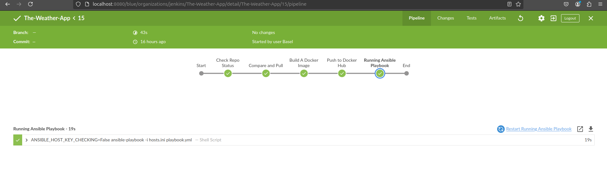
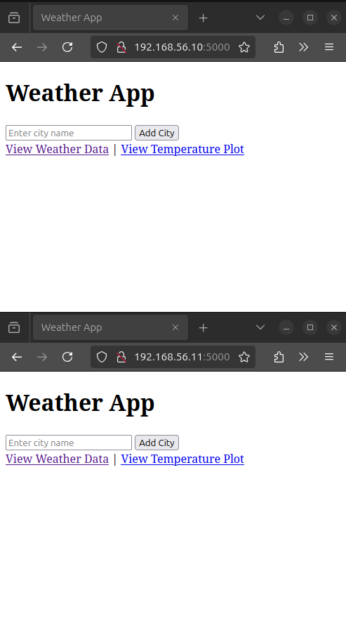

# ODC DevOps Final Project

This project demonstrates how to set up a CI/CD pipeline using GitHub, Jenkins, Docker, and Ansible. It automates the process of deploying a Python Weather app from source code to a Dockerized environment.

---

## Prerequisites
 
- A private GitHub repository for the source code
- Docker Hub account
- Vagrant installed on the main host(for virtual machine setup)
- Ubuntu Virtual Machine with a minimum 6GB memory
- SSH key configured for GitHub access
- Tools Installed on the Ubuntu VM :-
  - docker
  - docker-compose
  - openjdk-17-jre
  - Jenkins
    - Ansible Plugin
    - Blue Ocean Plugin
  - Ansible 


---

## Features

- CI/CD pipeline using Jenkins
- Docker containerization for `The Weather App` python application deployment
- Ansible playbook for deployment automation
- GitHub integration with Jenkins for automated builds
- Docker Hub integration for storing and sharing images

---

## Project Workflow

### 1. *Setup*
   - Generate and add an SSH key for your machine to securly access GitHub using the commands :-
      ```bash
      git config --global user.name "example"
      git config --global user.email "example@email.com"
      ssh-keygen -t rsa -b 4096 -C "example@email.com"
      even "$(ssh-agent -s)"
      ssh-add ~/.ssh/id_rsa
      cat ~/.ssh/id_rsa.pud
      ssh -T git@github.com
      ```
   - then add this key to you github SSH Keys section 
   - Create a private repository and push the code.
   - Write a [Dockerfile](Dockerfile) for the application.
   - Push the Docker image to Docker Hub using the commands :-
     ```bash
     docker login --username baselabouelnour --password <password>
     docker push baselabouelnour/devops-odc-final-project
     ```
   - Write Ansible inventory including that include the vagrant machine names, IPs, and the path to the ssh-key
   - Create a vagrantfile on the host machine with two machines using ubuntu/focal64 box (or any other box with 3.8 or 
      higher default python version)
***

### 2. *Deployment*
   - Use Vagrant to set up vms using the [Vagrantfile](Vagrantfile) & commands `vagrant up` followed up with `vagrant ssh-config`.
   - Copy the SSH keys to the Ubuntu ansible machine.
   - Write an Ansible [playbook](playbook.yml) and [inventory](hosts.ini) to deploy the application.
   - The [playbook](playbook.yml) does the following tasks:-
     1- Updates the Vagrant machines
     2- Install required packages for Docker
     3- Add Docker GPG key
     4- Add Docker repository
     5- Install Docker 
     6- Start the service and enable it
     7- Run the Docker Container 
   - make sure everything is working manually without an issue using the commands
     ```bash
     ansible all -m ping -u root
     ansible-playbook -i hosts.ini playbook.yml
     ```
***
     
### 3. *Automation*
   - Configure Jenkins with GitHub and Docker Hub plugins.
   - Create a Jenkins pipeline as shown in the [jenkinsfile](jenkinsfile) to automate the following tasks:
     - Clone or fetch updates from the repository.
     - Build a Docker image and push it to Docker Hub.
     - runs the ansible playbook
     - Build the pipeline
***
       
### 4. *Results*
   - The Output of these steps should be the success of the pipeline
     
   - The Weather app should be working on the two vagrant machines
      
***


---

## Steps to Run the Project
- All you need to run this project is to clone the repo using
  ```
  git clone git@github.com:Basel-Abouelnour/DevOps-ODC-Final-Project.git
  ```
- Then build the Jenkins Pipeline and everything should be done automatically
---
